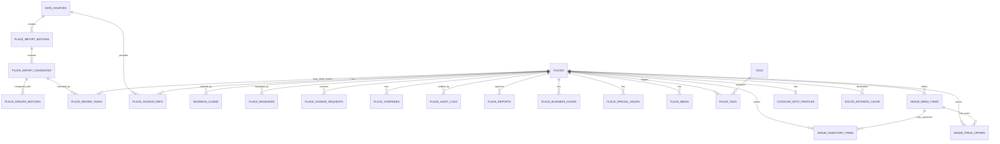

# Map / Place Service ERD v0.1

## 0. 목적

이 문서는 `map-service` 또는 `place-service`의 지도 DB 초안입니다.

이 DB는 단순 지도 마커 저장소가 아닙니다. 다음 역할을 동시에 수행합니다.

```text
1. 바 / 펍 / 주류점 / 야외 장소의 canonical place DB
2. 운영자와 점주가 Admin Page를 통해 수정하는 장소 관리 DB
3. 메뉴 / 시그니처 메뉴 / 재고 / 가격 관리 DB
4. 추천 서비스가 소비할 published snapshot source
5. 챗봇이 장소·재고·가격을 조회할 수 있는 tool/API source
6. 외부 source, 운영자 override, 점주 변경 요청, audit log를 남기는 검수형 DB
7. 공공데이터/현장조사/점주 입력 후보를 staging → review → publish 흐름으로 처리하는 import DB
```

## 1. 핵심 Ownership 결정

| 영역 | Canonical Owner | 비고 |
|---|---|---|
| 장소 기본정보 | `map-service/place-service` | 바, 펍, 주류점, 야외 장소 |
| 위치 / PostGIS 좌표 | `map-service/place-service` | 지도와 추천 모두 이 데이터를 기준으로 파생 |
| 상호명 / 주소 / 폐업 / 중복 병합 | `map-service/place-service` | 운영자가 최종 권한 보유 |
| 메뉴 / 시그니처 메뉴 | `map-service/place-service` | 점주/운영자 수정 |
| 재고 / 판매 가능 여부 | `map-service/place-service` | TTL과 confidence 필요 |
| 가격 정보 | `map-service/place-service` | valid period와 confidence 필요 |
| 점주 claim | `map-service/place-service` | auth-service user id만 문자열로 참조 |
| 사용자 계정 / 역할 | `auth-service` | map DB에 FK 연결 금지 |
| 주류 설명 / 향미 / RAG 지식 | `recommendation-service` 또는 향후 `catalog-service` | map DB가 주류 지식까지 소유하지 않음 |
| 추천 scoring / log | `recommendation-service` | map snapshot만 소비 |

## 2. 서비스 경계 규칙

```text
Admin Page is not a data owner.
Admin Page is a privileged UI client.
Admin Page writes through service APIs only.
```

```text
recommendation-service must not read or write map-service DB directly.
recommendation-service consumes published snapshots/events/internal APIs only.
```

```text
chatbot must not answer live place status, inventory, or price from RAG.
chatbot must call map-service APIs/tools for live place data.
```

## 3. DBML 파일

`dbdiagram.io`에는 다음 파일을 붙여넣습니다.

```text
map_place_service_erd_v0_2.dbml
```

주의:

- DBML에서는 PostGIS `geography(Point, 4326)`를 완전하게 표현하기 어렵기 때문에 `location geography`로 표현했습니다.
- 실제 migration에서는 `location geography(Point, 4326)` 또는 팀 표준에 따라 `geometry(Point, 4326)`를 사용합니다.
- 실제 migration에서는 공간 검색 인덱스를 `USING GIST (location)`로 생성해야 합니다.

## 4. 전체 테이블 그룹

```text
A. Source / Import / Staging
- data_sources
- place_import_batches
- place_import_candidates
- place_dedupe_matches
- place_review_tasks

B. Core Place
- places
- place_source_refs
- place_business_hours
- place_special_hours
- tags
- place_tags
- place_media

C. Admin / Ownership / Governance
- business_claims
- place_managers
- place_change_requests
- place_overrides
- place_audit_logs
- place_reports

D. Menu / Inventory / Price
- venue_menu_items
- venue_inventory_items
- venue_price_offers

E. Outdoor Spot
- outdoor_spot_profiles

F. Event / Sync
- place_outbox_events

G. Optional Route Cache
- route_estimate_cache
```

## 5. Mermaid ERD 개요



## 6. 핵심 테이블 설명

### 6.1 `data_sources`

데이터 출처를 정의합니다.

예:

```text
OPERATOR
OWNER
FIELD_RESEARCH
PUBLIC_DATA
KAKAO
USER_REPORT
SYSTEM
```

중요 필드:

```text
source_policy = STORABLE | REALTIME_ONLY | RESTRICTED
trust_level
license_name
license_url
```

Kakao처럼 장기 저장이 제한될 수 있는 source는 기본적으로 `REALTIME_ONLY` 또는 `RESTRICTED`로 둡니다.

### 6.2 `place_import_batches`

공공데이터 파일, 현장조사 파일, 운영자 수동 업로드, 점주 제출 등 import 단위를 기록합니다.

목적:

```text
- 언제 어떤 source에서 어떤 파일/데이터를 가져왔는지 추적
- row_count / error_count 기록
- checksum으로 중복 import 방지
- import 실패/성공 상태 관리
```

### 6.3 `place_import_candidates`

아직 canonical `places`가 아닌 장소 후보입니다.

공공데이터, 현장조사, 점주 입력, 사용자 제보를 바로 `places`에 넣지 않고 이 테이블에 먼저 넣습니다.

목적:

```text
- raw_payload_json 보존
- normalized_name / normalized_address 생성
- candidate_place_type 추정
- 중복 후보 판단
- 운영자 review 대상으로 올림
```

### 6.4 `place_dedupe_matches`

후보 장소와 기존 `places` 간의 중복 가능성을 기록합니다.

예:

```text
candidate: 맥주창고 강남점
existing: 맥주창고 역삼점
confidence: 0.82
status: PENDING
```

이 테이블을 두는 이유는 중복 병합을 자동으로 처리하지 않고, 운영자 검수로 넘기기 위해서입니다.

### 6.5 `place_review_tasks`

검수 큐입니다.

생성되는 경우:

```text
- 새 장소 후보 승인 필요
- 중복 후보 검수 필요
- 폐업/재오픈 충돌
- 좌표 불확실
- source 간 주소/상호명 충돌
- 점주 민감 변경 요청
- 사용자 제보 검수
```

### 6.6 `places`

최종 canonical 장소 테이블입니다.

중요 상태:

```text
DRAFT
ACTIVE
HIDDEN
TEMPORARILY_CLOSED
CLOSED
DUPLICATE_MERGED
REJECTED
ARCHIVED
```

지도/추천에 노출되는 기본 조건:

```sql
status = 'ACTIVE'
AND publication_status = 'PUBLISHED'
AND published_at IS NOT NULL
```

추천 후보 조건:

```sql
status = 'ACTIVE'
AND publication_status = 'PUBLISHED'
AND recommendation_eligible = true
```

재활성화 금지 규칙:

```text
if place.status in ["CLOSED", "ARCHIVED", "DUPLICATE_MERGED"]:
    ingestion_worker must not reactivate automatically
    create review_task instead
```

### 6.7 `place_source_refs`

canonical `places`가 어떤 source와 연결되어 있는지 기록합니다.

예:

```text
place_id = 우리 canonical place id
source_type = PUBLIC_DATA
external_source_id = 공공데이터 상가업소번호
source_policy = STORABLE
```

Kakao를 참조하더라도 canonical source로 취급하지 않도록 `source_policy`를 반드시 남깁니다.

### 6.8 `business_claims` / `place_managers`

점주가 장소를 claim하면 `business_claims`에 pending으로 쌓입니다.

운영자가 승인하면 `place_managers`에 owner/manager/staff 권한이 생성됩니다.

DB FK는 auth-service에 걸지 않습니다.

```text
user_id = auth-service user id string
```

### 6.9 `place_change_requests`

점주가 바로 수정하면 안 되는 민감 필드 변경 요청입니다.

승인 필요:

```text
- 상호명 변경
- 주소 변경
- 좌표 변경
- 업종 변경
- 폐업 처리
- 재오픈
- 소유권 이전
- 중복 병합 요청
```

### 6.10 `place_overrides`

운영자 override입니다.

source 간 충돌이 있을 때 운영자 판단이 최우선입니다.

우선순위:

```text
1. operator_override
2. operator_verified
3. owner_verified
4. field_research
5. public_data
6. external_realtime_source
7. user_report_pending
```

### 6.11 `place_audit_logs`

장소 관련 쓰기 작업의 감사 로그입니다.

대상:

```text
- place
- source_ref
- menu_item
- inventory_item
- price_offer
- claim
- change_request
- override
- import_batch
- import_candidate
- review_task
```

### 6.12 `venue_menu_items`

장소별 메뉴입니다.

`beverage_catalog_ref_id`는 recommendation-service 또는 catalog-service의 beverage id를 문자열로 참조합니다.
Cross-service FK를 걸지 않습니다.

### 6.13 `venue_inventory_items`

재고/판매 가능 여부입니다.

필수 개념:

```text
availability_status
stock_confidence
last_seen_at
expires_at
revision
```

추천에서는 오래된 재고를 감점하거나 제외해야 합니다.

### 6.14 `venue_price_offers`

가격 정보입니다.

필수 개념:

```text
price_krw
price_type
valid_from
valid_until
confidence
revision
```

추천에서는 오래된 가격을 감점하거나 제외해야 합니다.

### 6.15 `outdoor_spot_profiles`

한강공원 치맥 같은 야외 장소 전용 profile입니다.

야외 장소는 보통 점주 owner가 없으므로 운영자 curated data로 관리합니다.

추천에서는 “술을 파는 장소”가 아니라 다음 개념으로 다룹니다.

```text
술을 마시기 좋은 장소 + 근처 구매 후보 + 이동 동선
```

### 6.16 `place_outbox_events`

추천 서비스와 챗봇/search index가 map DB를 직접 읽지 않도록 하는 outbox입니다.

주요 이벤트:

```text
place.published
place.updated
place.hidden
place.closed
place.merged
menu.created
menu.updated
menu.discontinued
inventory.updated
price.updated
claim.approved
```

### 6.17 `route_estimate_cache`

MVP 필수는 아닙니다.

대중교통/동선 최적화가 붙을 때 optional cache로 사용합니다.

## 7. MVP Migration Scope

1차 migration에 추천하는 테이블:

```text
1. data_sources
2. place_import_batches
3. place_import_candidates
4. place_dedupe_matches
5. place_review_tasks
6. places
7. place_source_refs
8. business_claims
9. place_managers
10. place_change_requests
11. place_overrides
12. place_audit_logs
13. venue_menu_items
14. venue_inventory_items
15. venue_price_offers
16. outdoor_spot_profiles
17. place_outbox_events
```

후순위 optional:

```text
- tags
- place_tags
- place_media
- place_business_hours
- place_special_hours
- place_reports
- route_estimate_cache
```

단, 지도 화면 MVP에 이미지/태그/영업시간이 반드시 필요하다면 optional display tables를 1차에 포함할 수 있습니다.

## 8. Migration 순서 초안

```text
001_enable_extensions
- CREATE EXTENSION IF NOT EXISTS postgis;
- CREATE EXTENSION IF NOT EXISTS pgcrypto;

002_create_source_import_staging
- data_sources
- place_import_batches
- place_import_candidates
- place_dedupe_matches
- place_review_tasks

003_create_place_core
- places
- place_source_refs

004_create_admin_governance
- business_claims
- place_managers
- place_change_requests
- place_overrides
- place_audit_logs

005_create_menu_inventory_price
- venue_menu_items
- venue_inventory_items
- venue_price_offers

006_create_outdoor_and_outbox
- outdoor_spot_profiles
- place_outbox_events

007_create_optional_map_display_tables
- tags
- place_tags
- place_media
- place_business_hours
- place_special_hours
- place_reports

008_create_optional_route_cache
- route_estimate_cache
```

## 9. 실제 SQL Index 주의사항

DBML에 표현된 일반 인덱스 외에 실제 PostgreSQL migration에서는 다음이 필요합니다.

```sql
CREATE INDEX idx_places_location_gist
ON places
USING GIST (location);

CREATE INDEX idx_import_candidates_location_gist
ON place_import_candidates
USING GIST (location);
```

추천 public query:

```sql
CREATE INDEX idx_places_public_active_published
ON places (place_type, updated_at)
WHERE status = 'ACTIVE'
  AND publication_status = 'PUBLISHED';
```

추천 후보 query:

```sql
CREATE INDEX idx_places_recommendation_eligible
ON places (place_type, updated_at)
WHERE status = 'ACTIVE'
  AND publication_status = 'PUBLISHED'
  AND recommendation_eligible = true;
```

## 10. Recommendation Snapshot 연동

추천 서비스는 map DB를 직접 읽지 않습니다.

map-service가 outbox 또는 internal API를 통해 snapshot을 제공합니다.

예:

```json
{
  "event_type": "place.updated",
  "place_id": "uuid",
  "place_revision": 17,
  "payload": {
    "place_type": "LIQUOR_SHOP",
    "name": "Example Bottle Shop",
    "status": "ACTIVE",
    "publication_status": "PUBLISHED",
    "location": {
      "lat": 37.5665,
      "lng": 126.9780
    },
    "recommendation_eligible": true,
    "tags": ["whiskey", "bottle_shop", "near_station"]
  }
}
```

추천 서비스 read model 예시:

```text
venue_snapshots
- place_id
- place_revision
- name
- place_type
- location
- status
- snapshot_json
- synced_at

venue_inventory_snapshots
- place_id
- beverage_id
- availability_status
- price_krw
- confidence
- last_seen_at
- synced_at
```

추천 결과 로그에는 반드시 다음을 남깁니다.

```text
place_revision
inventory_revision
price_revision
score_breakdown_json
reason_codes
```

## 11. 남은 결정 사항

Codex가 migration을 만들기 전에 사람이 결정해야 할 부분:

```text
1. map-service 이름을 유지할지, place-service로 분리할지
2. MVP 지역 범위
3. public data source별 저장 가능 여부와 라이선스 검토 결과
4. Kakao API 사용 범위에 대한 법무/정책 검토
5. location 타입: geography(Point, 4326) vs geometry(Point, 4326)
6. auth-service user id 타입: text vs uuid string
7. beverage_catalog_ref_id 네이밍: catalog-service가 생길 가능성 반영 여부
8. 재고/가격 TTL 기본값
9. 운영자 review UI가 1차 MVP에 포함되는지
```
