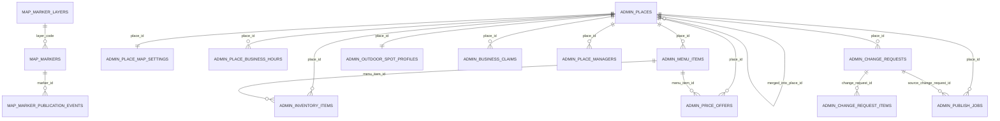

# Map View + Admin Ops FK Visualization v0.10

## 목적

이 문서는 `map_view`와 `admin_ops`를 분리한 상태에서 **실제 DB 외래키 관계**와 **발행 시점의 논리 관계**를 구분해서 보여줍니다.

핵심 원칙은 다음입니다.

```text
map_view
= 지도 화면에 마커를 그리기 위한 최소 read model

admin_ops
= 장소, 상호명, 주소, 종류, 운영시간, 메뉴, 재고, 가격, 점주 요청, 운영자 승인, 발행 workflow의 canonical DB
```

## 실제 DB FK 원칙

실제 DB FK는 기본적으로 아래 범위에만 둡니다.

```text
1. map_view 내부 FK
2. admin_ops 내부 FK
```

아래는 실제 FK로 두지 않습니다.

```text
- auth-service user id
- recommendation-service beverage/catalog id
- map_view.markers.place_ref -> admin_ops.places.id
- admin_ops.place_map_settings.layer_code -> map_view.marker_layers.code
```

이유는 `map_view`가 나중에 별도 DB/read model로 분리될 수 있고, 추천 서비스나 인증 서비스와 cross-service FK를 만들면 서비스 경계가 무너지기 때문입니다.

---

## Mermaid ERD



---

## 실제 FK 목록

| From table | From column | To table | To column | 의미 |
|---|---:|---|---:|---|
| `map_view.markers` | `layer_code` | `map_view.marker_layers` | `code` | 마커가 속한 지도 레이어 |
| `map_view.marker_publication_events` | `marker_id` | `map_view.markers` | `id` | 마커 발행 이벤트의 대상 마커 |
| `admin_ops.places` | `merged_into_place_id` | `admin_ops.places` | `id` | 중복 장소 병합 대상 |
| `admin_ops.place_map_settings` | `place_id` | `admin_ops.places` | `id` | 장소별 지도 마커 설정 |
| `admin_ops.place_business_hours` | `place_id` | `admin_ops.places` | `id` | 장소별 운영시간 |
| `admin_ops.menu_items` | `place_id` | `admin_ops.places` | `id` | 장소별 메뉴 |
| `admin_ops.inventory_items` | `place_id` | `admin_ops.places` | `id` | 장소별 재고 |
| `admin_ops.inventory_items` | `menu_item_id` | `admin_ops.menu_items` | `id` | 메뉴와 연결된 재고 |
| `admin_ops.price_offers` | `place_id` | `admin_ops.places` | `id` | 장소별 가격 |
| `admin_ops.price_offers` | `menu_item_id` | `admin_ops.menu_items` | `id` | 메뉴와 연결된 가격 |
| `admin_ops.outdoor_spot_profiles` | `place_id` | `admin_ops.places` | `id` | 야외 장소 상세 프로필 |
| `admin_ops.business_claims` | `place_id` | `admin_ops.places` | `id` | 사장님/관리자 소유권 요청 |
| `admin_ops.place_managers` | `place_id` | `admin_ops.places` | `id` | 장소 관리자 권한 |
| `admin_ops.change_requests` | `place_id` | `admin_ops.places` | `id` | 장소 변경 요청 |
| `admin_ops.change_request_items` | `change_request_id` | `admin_ops.change_requests` | `id` | 변경 요청의 상세 항목 |
| `admin_ops.publish_jobs` | `place_id` | `admin_ops.places` | `id` | 발행 대상 장소 |
| `admin_ops.publish_jobs` | `source_change_request_id` | `admin_ops.change_requests` | `id` | 발행을 발생시킨 변경 요청 |

---

## 논리 관계: 실제 FK가 아니라 publish workflow로 연결

아래 관계는 **시각화와 이해를 위한 논리 관계**입니다. 실제 DB FK로 만들지 않는 것을 권장합니다.

| Source | Target | 관계 | 실제 FK 여부 |
|---|---|---|---|
| `admin_ops.places.id` | `map_view.markers.place_ref` | 발행된 장소가 지도 마커가 됨 | No |
| `admin_ops.places.display_name` | `map_view.markers.label` | 승인된 상호명 복사 | No |
| `admin_ops.places.location` | `map_view.markers.location` | 승인된 좌표 복사 | No |
| `admin_ops.place_map_settings.layer_code` | `map_view.markers.layer_code` | 승인된 지도 레이어 복사 | No |
| `admin_ops.place_map_settings.icon_key_override` | `map_view.markers.icon_key` | 승인된 아이콘 override 복사 | No |
| `admin_ops.place_map_settings.marker_visibility` | `map_view.markers.visibility` | 승인된 노출 상태 복사 | No |
| `admin_ops.publish_jobs.marker_payload_json` | `map_view.markers` | publish job이 marker upsert payload 생성 | No |
| `admin_ops.publish_jobs` | `map_view.marker_publication_events` | publish 이후 캐시/추천 sync 이벤트 생성 | No |

흐름은 다음입니다.

```text
Owner / Manager / Operator
  -> Admin Page
  -> Admin API
  -> admin_ops.change_requests
  -> operator approval
  -> admin_ops canonical tables update
  -> admin_ops.publish_jobs
  -> map_view.markers upsert
  -> map_view.marker_publication_events append
```

---

## dbdiagram.io 사용법

`map_admin_physical_fk_erd_v0_10.dbml` 파일 내용을 dbdiagram.io에 붙여넣으면 됩니다.

이 DBML은 **실제 FK 중심**입니다. 즉, `map_view.markers.place_ref -> admin_ops.places.id` 같은 논리 관계는 DBML Ref로 넣지 않았습니다.

실제 migration에서도 이 원칙을 유지하는 것을 권장합니다.

```text
Physical FK = admin_ops 내부, map_view 내부
Logical publish mapping = publish service/application logic
```
